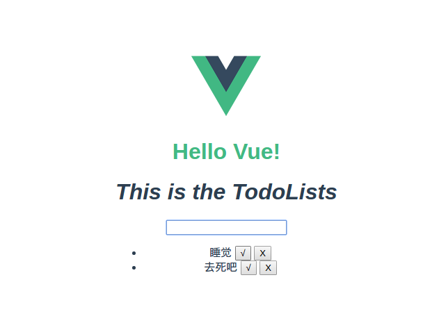
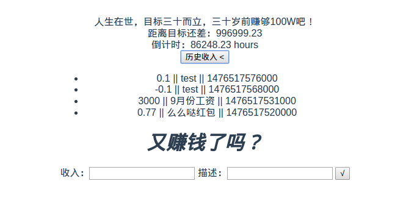

# Vue.js 从入门到放弃

## 说明

http://rc.vuejs.org/ 用的是Vue2.0 ，和1的区别例如v-for 里的index写法不一样了,orderBy也不一样了

2.0没有中文文档...

这里有两个“应用”，一个是官方的demo todolist 
http://tmn07.com/todo/

另一个是GOM web单机版 ,木有前端233
http://tmn07.com/gom/

在main.js里修改就能切换应用了。

基于Webpack框架吧。一开始看的www.imooc.com/learn/694 这个。老师讲的不错，不过是1.0版本的。不知道它自带的.gitignore好不好使...

对MVVM理解，还不是很多。双向绑定，指令，组件化，数据的传输，就简单了解了一点。。

感觉需要一个完整的项目，看看人家是怎么写的。不然不怎么会用2333